<div align="center">

<a href="#-explore-the-portfolio">
  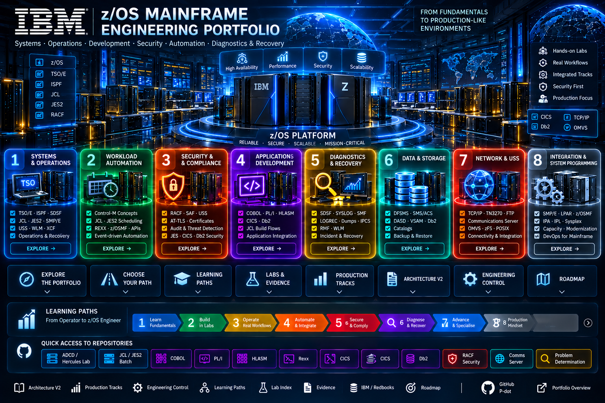
</a>

<br><br>

<a href="#-explore-the-portfolio"><b>EXPLORE</b></a>
&nbsp;&nbsp;•&nbsp;&nbsp;
<a href="#-choose-your-path"><b>CHOOSE YOUR PATH</b></a>
&nbsp;&nbsp;•&nbsp;&nbsp;
<a href="#-learning-paths--from-operator-to-zos-engineer"><b>LEARNING PATHS</b></a>
&nbsp;&nbsp;•&nbsp;&nbsp;
<a href="#-labs--evidence"><b>LABS & EVIDENCE</b></a>
&nbsp;&nbsp;•&nbsp;&nbsp;
<a href="#-production-tracks"><b>PRODUCTION TRACKS</b></a>

<br><br>

<a href="https://github.com/P-dot/zos-adcd-hercules-engineering-lab/tree/main/docs/architecture/v2">
  
</a>
<a href="https://github.com/P-dot/zos-adcd-hercules-engineering-lab/tree/main/docs/engineering-control">
  
</a>
<a href="https://github.com/P-dot/mainframe-racf-security-evidence">
  
</a>
<a href="https://github.com/P-dot/zos-batch-scheduler">
  
</a>

</div>

---

## 🧭 Explore the Portfolio

<div align="center">

<table>
<tr>
<td width="50%" align="center">
<a href="#-system-programmer-engineering-domains">
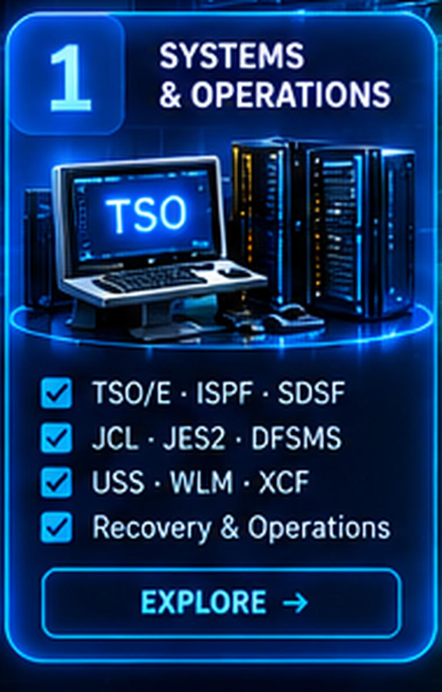
</a><br>
<a href="#-system-programmer-engineering-domains"><b>ENTER SYSTEMS & OPERATIONS →</b></a>
</td>
<td width="50%" align="center">
<a href="#%EF%B8%8F-workload-automation-engineering">
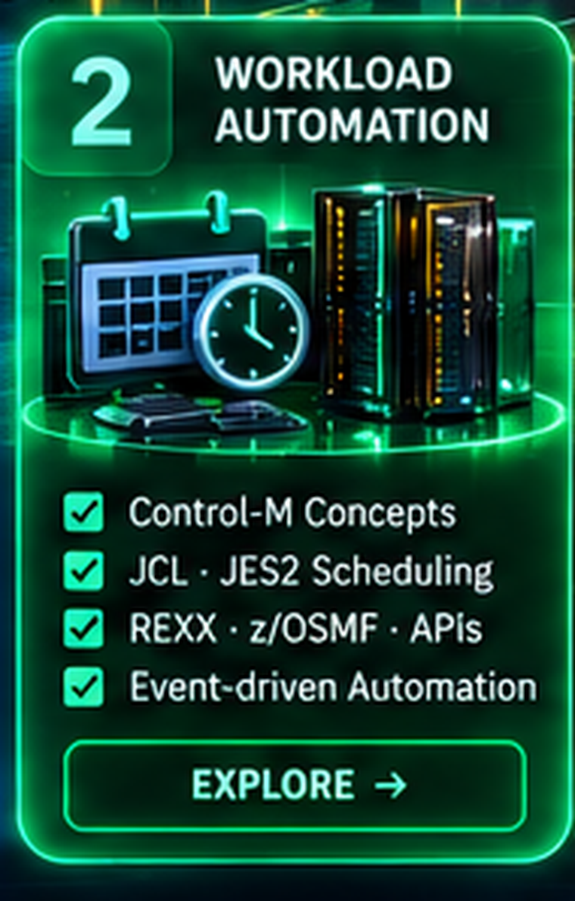
</a><br>
<a href="#%EF%B8%8F-workload-automation-engineering"><b>ENTER WORKLOAD AUTOMATION →</b></a>
</td>
</tr>

<tr>
<td width="50%" align="center">
<a href="#%EF%B8%8F-security-first-mainframe-engineering">
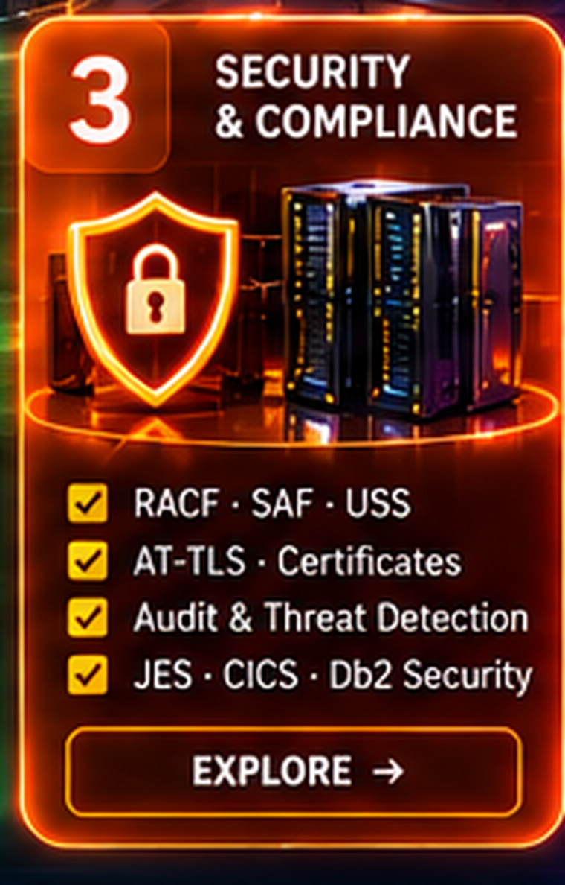
</a><br>
<a href="#%EF%B8%8F-security-first-mainframe-engineering"><b>ENTER SECURITY ENGINEERING →</b></a>
</td>
<td width="50%" align="center">
<a href="https://github.com/P-dot/mainframe-cobol-db2-cics-devops-lab">
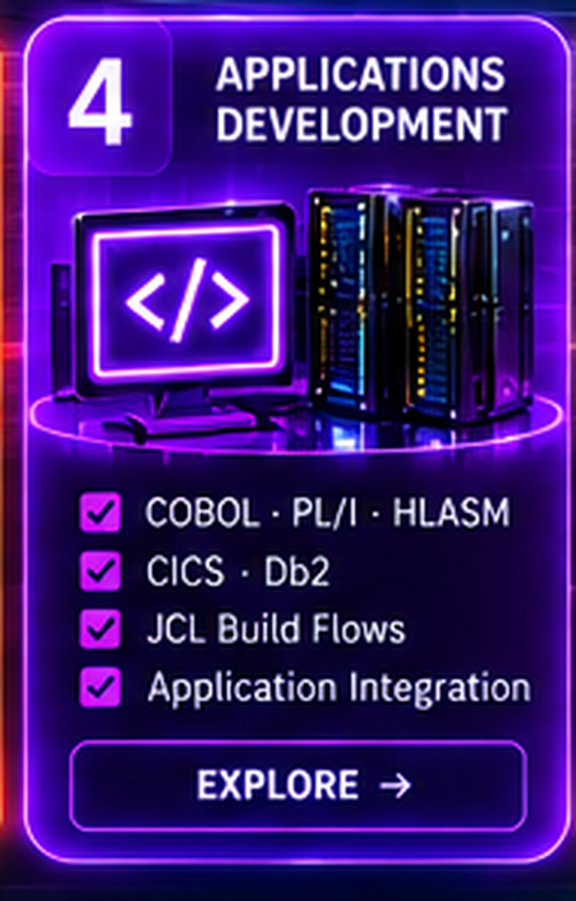
</a><br>
<a href="https://github.com/P-dot/mainframe-cobol-db2-cics-devops-lab"><b>ENTER APPLICATION DEVELOPMENT →</b></a>
</td>
</tr>

<tr>
<td width="50%" align="center">
<a href="https://github.com/P-dot/zos-problem-determination-diagnostics">
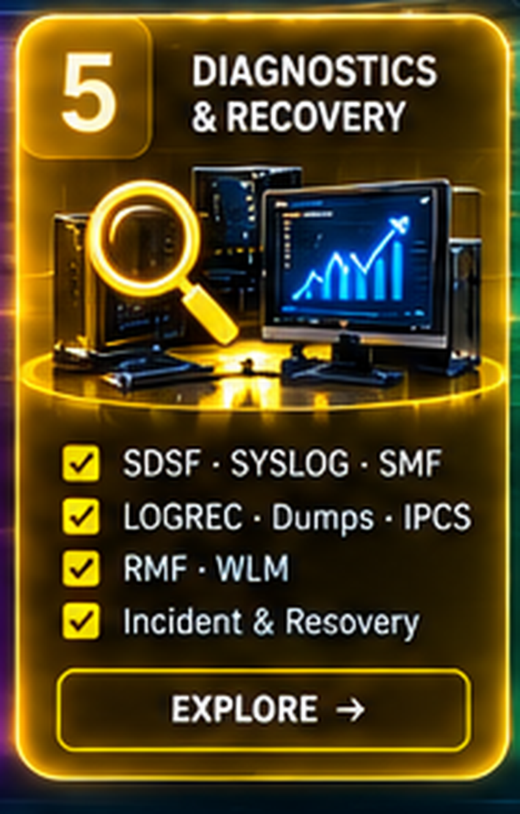
</a><br>
<a href="https://github.com/P-dot/zos-problem-determination-diagnostics"><b>ENTER DIAGNOSTICS & RECOVERY →</b></a>
</td>
<td width="50%" align="center">
<a href="https://github.com/P-dot/zos-adcd-hercules-engineering-lab">
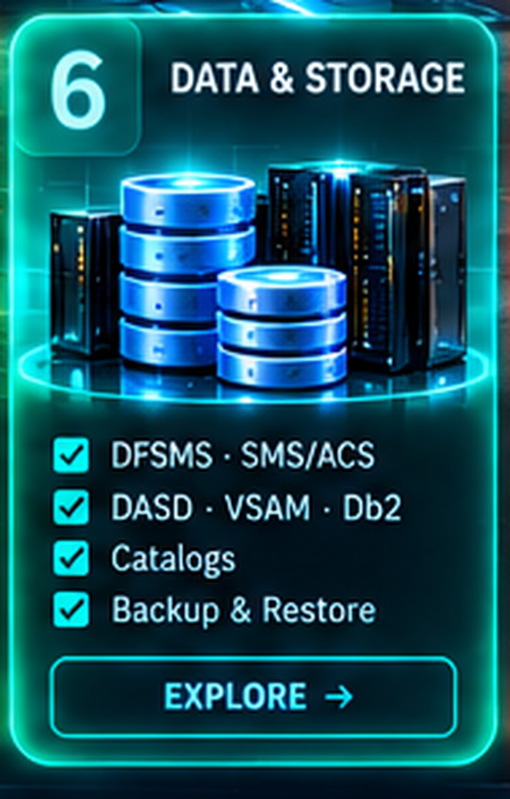
</a><br>
<a href="https://github.com/P-dot/zos-adcd-hercules-engineering-lab"><b>ENTER DATA & STORAGE →</b></a>
</td>
</tr>

<tr>
<td width="50%" align="center">
<a href="https://github.com/P-dot/zos-communications-server-network-lab">
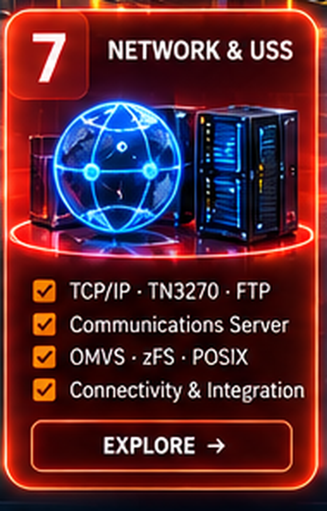
</a><br>
<a href="https://github.com/P-dot/zos-communications-server-network-lab"><b>ENTER NETWORK & USS →</b></a>
</td>
<td width="50%" align="center">
<a href="#-production-tracks">
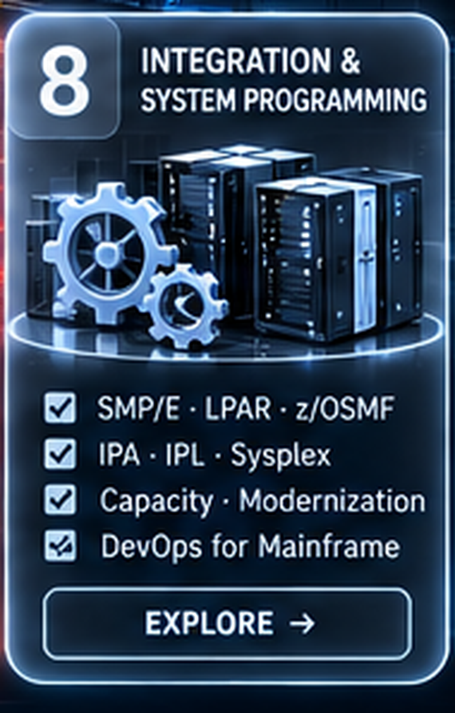
</a><br>
<a href="#-production-tracks"><b>ENTER INTEGRATION & SYSTEM PROGRAMMING →</b></a>
</td>
</tr>
</table>

</div>

> **Portal model:** the visual layer is navigation; the repositories and published evidence remain the source of truth.

---

## 🛤️ Choose Your Path

<div align="center">
<table>
<tr>
<td width="33%" align="center">
<a href="https://github.com/P-dot/MVS_TSO_ISPF">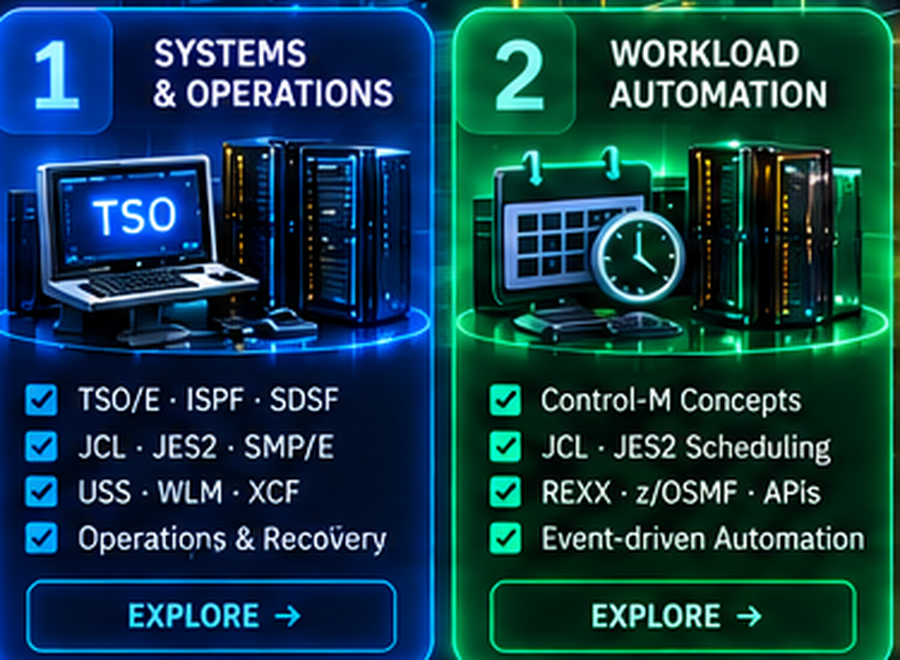</a><br>
<b>z/OS ADMINISTRATOR</b><br>
TSO/E → ISPF → SDSF → JCL → JES2 → DFSMS → USS/TCP-IP
</td>
<td width="33%" align="center">
<a href="https://github.com/P-dot/zos-batch-scheduler">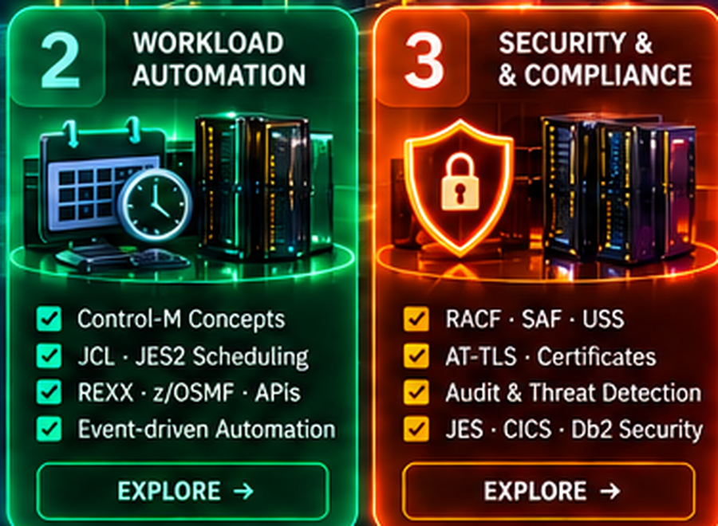</a><br>
<b>WORKLOAD AUTOMATION ENGINEER</b><br>
JCL/JES2 → Scheduling → Control-M concepts → REXX → workflows/APIs
</td>
<td width="33%" align="center">
<a href="https://github.com/P-dot/mainframe-racf-security-evidence">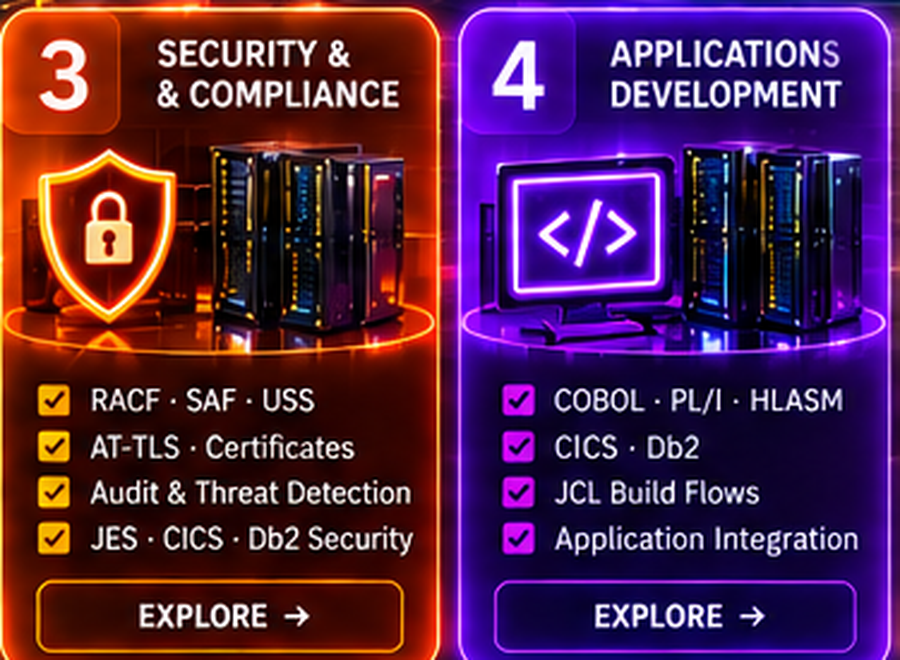</a><br>
<b>MAINFRAME SECURITY ENGINEER</b><br>
SAF/RACF → JES/USS/Network → CICS/Db2 → certificates/AT-TLS → audit
</td>
</tr>
<tr>
<td width="33%" align="center">
<a href="https://github.com/P-dot/mainframe-cobol-db2-cics-devops-lab">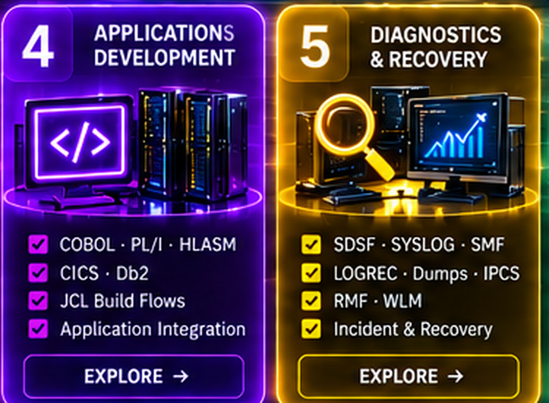</a><br>
<b>MAINFRAME DEVELOPER</b><br>
JCL → COBOL → VSAM/Db2 → CICS → PL/I → HLASM
</td>
<td width="33%" align="center">
<a href="https://github.com/P-dot/zos-problem-determination-diagnostics">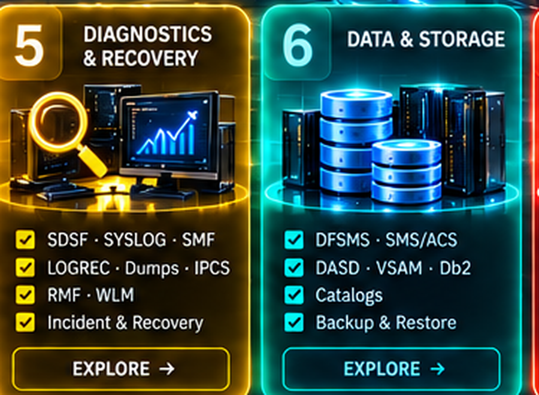</a><br>
<b>PRODUCTION SUPPORT ENGINEER</b><br>
SDSF/SYSLOG → SMF/LOGREC → dumps/IPCS → RMF/WLM → recovery
</td>
<td width="33%" align="center">
<a href="https://github.com/P-dot/zos-adcd-hercules-engineering-lab">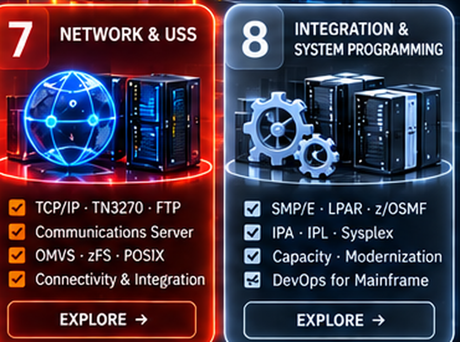</a><br>
<b>z/OS SYSTEM PROGRAMMER</b><br>
IPL/PARMLIB → program management → HCD/IODF → SMP/E → Sysplex
</td>
</tr>
</table>
</div>

> These paths converge in production-like engineering: workload, authority, data, networking, observability, recovery and automation are treated as one system.

---

## 🧩 Engineering Domains

| Domain | Technical scope | Primary entry |
|---|---|---|
| **Core Platform Engineering** | Initialization, services, IPL/PARMLIB, system libraries, I/O | [Core Engineering](https://github.com/P-dot/zos-adcd-hercules-engineering-lab) |
| **Operations & Workload** | TSO/ISPF, SDSF, JCL, JES2, scheduling, restart/rerun | [TSO/ISPF](https://github.com/P-dot/MVS_TSO_ISPF) · [JCL](https://github.com/P-dot/JCL_LABS) · [Scheduler](https://github.com/P-dot/zos-batch-scheduler) |
| **Storage & Data** | DFSMS, SMS/ACS, DASD, VSAM, catalogs, Db2, recovery | [VSAM](https://github.com/P-dot/vsam01) · [Db2](https://github.com/P-dot/DB2-) |
| **Application Engineering** | COBOL, PL/I, HLASM, CICS, Db2 integration | [COBOL](https://github.com/P-dot/COBOL) · [PL/I](https://github.com/P-dot/PL-I) · [HLASM](https://github.com/P-dot/z_Assembly) · [CICS](https://github.com/P-dot/CICS) |
| **Security Engineering** | RACF/SAF, least privilege, trust boundaries, audit | [Security Evidence](https://github.com/P-dot/mainframe-racf-security-evidence) |
| **Communications & USS** | TCP/IP, services, TN3270/FTP, OMVS, zFS, POSIX | [Communications](https://github.com/P-dot/zos-communications-server-network-lab) · [USS](https://github.com/P-dot/UNIX_System_Services-) |
| **Automation & Modern Operations** | REXX, scheduler, shell, z/OSMF/workflows/APIs | [REXX](https://github.com/P-dot/Rexx) · [Scheduler](https://github.com/P-dot/zos-batch-scheduler) |
| **Diagnostics & Performance** | SYSLOG, SMF, LOGREC, dumps/IPCS, RMF/WLM | [Diagnostics](https://github.com/P-dot/zos-problem-determination-diagnostics) |
| **Integration Engineering** | Cross-repository production-like workflows | [Integration](https://github.com/P-dot/mainframe-cobol-db2-cics-devops-lab) |

### Cross-cutting engineering planes

**🛡 Security** — identity, authority, trust boundaries and audit.
**📊 Observability** — SDSF, SYSLOG, SMF, LOGREC, Health Checker and RMF/WLM.
**⚙ Automation** — JCL, REXX, scheduling, shell, workflows and APIs.

---

## 🗺️ Technical Architecture


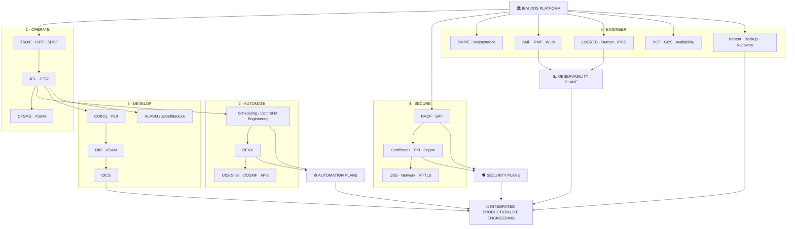

### Three engineering planes cross every domain

**Security** is not a final chapter: identities, authority, resources, trust boundaries and audit must be considered in every domain.
**Observability** is not “the SMF repo”: SDSF, SYSLOG, SMF, LOGREC, Health Checker and RMF/WLM provide evidence about the system.
**Automation** is progressive: manual understanding → repeatable JCL/REXX → scheduler/workflow → API-driven operation.

---

## 📚 Learning Paths — from Operator to z/OS Engineer

```mermaid
flowchart LR
    L0["L0 · Foundations<br/>Architecture · TSO/ISPF · SDSF"]
    L1["L1 · Workload<br/>JCL · JES2 · Scheduling"]
    L2["L2 · Data & Storage<br/>DFSMS · VSAM · Db2"]
    L3["L3 · Development<br/>COBOL · PL/I · HLASM · CICS"]
    L4["L4 · Systems<br/>USS · TCP/IP · SMP/E · WLM"]
    L5["L5 · Security<br/>RACF/SAF · PKI · AT-TLS · Audit"]
    L6["L6 · Reliability<br/>SMF · LOGREC · IPCS · Recovery"]
    L7["L7 · Automation<br/>REXX · Control-M · z/OSMF · APIs"]
    L8["L8 · Integration<br/>Production-like engineering"]

    L0 --> L1 --> L2 --> L3 --> L4 --> L5 --> L6 --> L7 --> L8
```

The learning model is **spiral rather than strictly linear**. Security, diagnosis and automation begin early and become deeper as the underlying system knowledge grows.

### Study order for this portfolio

**First priority — control the operating environment:** TSO/E → ISPF → SDSF → JCL → JES2.
**Second — understand production flow:** scheduling/Control-M concepts → RC/ABEND → restart/rerun → evidence.
**Third — automate:** REXX → ISPF services → USS shell → z/OSMF/workflows/APIs.
**Fourth — understand data and applications:** DFSMS/VSAM → COBOL → Db2 → CICS → PL/I.
**Fifth — go below the abstraction:** HLASM/zArchitecture, Language Environment, program management.
**In parallel from the beginning — secure and observe:** RACF/SAF, SMF/SYSLOG/SDSF, Communications/USS security.
**Then deepen system programming:** SMP/E, PARMLIB/PROCLIB, APF/LNKLST/LPA, WLM/RMF, XCF/GRS, diagnostics and recovery.

---

## 🧪 Labs & Evidence

> **Evidence model:** `● VALIDATED` = demonstrated with published evidence · `◐ ACTIVE` = capability currently being expanded · `○ ROADMAP` = planned, not yet claimed as validated.

| Engineering Domain | Laboratory | Engineering role |
|---|---|---|
| 🏛️ Core Platform | [zos-adcd-hercules-engineering-lab](https://github.com/P-dot/zos-adcd-hercules-engineering-lab) | z/OS core, system programming, architecture, operations and integration |
| 🖥️ TSO / ISPF | [MVS_TSO_ISPF](https://github.com/P-dot/MVS_TSO_ISPF) | Interactive operating environment and operator workflow |
| 📦 Batch | [JCL_LABS](https://github.com/P-dot/JCL_LABS) | JCL, procedures, utilities, datasets, IDCAMS and GDGs |
| ⚙️ Scheduling | [zos-batch-scheduler](https://github.com/P-dot/zos-batch-scheduler) | Enterprise workload automation, Control-M-oriented engineering and recovery |
| 🛡️ Security | [mainframe-racf-security-evidence](https://github.com/P-dot/mainframe-racf-security-evidence) | RACF/SAF, authorization, least privilege, trust boundaries and audit evidence |
| 🌐 Communications | [zos-communications-server-network-lab](https://github.com/P-dot/zos-communications-server-network-lab) | TCP/IP, TN3270, FTP, diagnostics, hardening and AT-TLS readiness |
| 🐚 USS | [UNIX_System_Services-](https://github.com/P-dot/UNIX_System_Services-) | OMVS, POSIX, filesystem, permissions, processes and shell |
| 💼 COBOL | [COBOL](https://github.com/P-dot/COBOL) | Enterprise application programming |
| 🗃️ VSAM | [vsam01](https://github.com/P-dot/vsam01) | ESDS, KSDS, RRDS, LDS and data access |
| 🧱 Db2 | [DB2-](https://github.com/P-dot/DB2-) | Db2 for z/OS, SQL and application data |
| 🔁 CICS | [CICS](https://github.com/P-dot/CICS) | Online transaction processing |
| 🤖 REXX | [Rexx](https://github.com/P-dot/Rexx) | TSO/E, ISPF and operations automation |
| 🧬 PL/I | [PL-I](https://github.com/P-dot/PL-I) | PL/I application development |
| 🧠 HLASM | [z_Assembly](https://github.com/P-dot/z_Assembly) | z/Architecture and low-level programming |
| 🔬 Diagnostics | [zos-problem-determination-diagnostics](https://github.com/P-dot/zos-problem-determination-diagnostics) | Problem determination, evidence, diagnosis and recovery |
| 🚀 Integration | [mainframe-cobol-db2-cics-devops-lab](https://github.com/P-dot/mainframe-cobol-db2-cics-devops-lab) | Cross-domain production-like scenarios |

---

## 🛡️ Security-First Mainframe Engineering

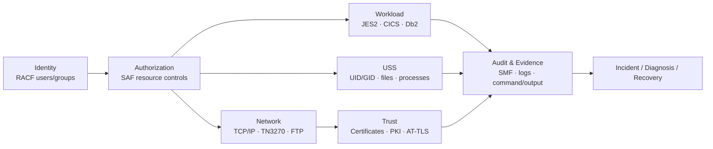

Security labs should increasingly prove **boundaries and evidence**, not merely successful commands: who can perform an action, which resource is protected, what failure looks like, where it is recorded, how access is reduced, and how the system is restored safely.

---

## ⚙️ Workload Automation Engineering

```mermaid
flowchart LR
    DEF["Workload definition"] --> J["JCL"]
    J --> JES["JES2"]
    JES --> SCH["Scheduler / Control-M model"]
    SCH --> DEP["Conditions · Resources · Calendars"]
    DEP --> EXEC["Submission · JOBID · Tracking"]
    EXEC --> RES["RC / ABEND classification"]
    RES --> RR["Restart / Rerun"]
    RR --> HIST["History · Audit · Evidence"]
    HIST --> AUTO["REXX / APIs / Event-driven automation"]
```

The objective is not only to *operate* a scheduler. It is to understand and engineer workload orchestration: dependencies, resources, calendars, conditions, failure handling, restartability, security boundaries, observability and eventually event/API-driven automation.

---

## 🔬 System Programmer Engineering Domains

| Domain | Core capabilities | Direction |
|---|---|---|
| Core Platform | IPL, PARMLIB, PROCLIB, LPA, LNKLST, APF, started tasks | deepen controlled change |
| Workload | JES2, SDSF, JCL, scheduler | automate + integrate |
| Storage & DFSMS | catalogs, SMS, ACS, VSAM, DASD, backup/restore | domain-native capability growth |
| Software Maintenance | SMP/E, CSI, SYSMOD, HOLDDATA, RECEIVE/APPLY/ACCEPT | build full maintenance lifecycle |
| Performance | SMF, RMF, WLM/SRM | diagnosis + capacity workflow |
| Diagnostics | SYSLOG, LOGREC, dumps, IPCS | structured problem determination |
| Availability | XCF, GRS, Logger, restart | resilience engineering |
| USS & Communications | OMVS, zFS, TCP/IP, VTAM concepts, services | secure services + automation |
| Security | RACF/SAF, certificates, crypto, audit | cross-domain security engineering |
| Applications & Data | COBOL, PL/I, HLASM, Db2, CICS, VSAM | integrated application flows |

---

## 🚦 Engineering Lifecycle

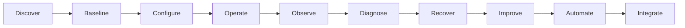

Every new lab should answer: **Which domain? Which capability? Which evidenced gap? Which lifecycle stage? Which maturity level? Which integration level? What proves success? What is the recovery path?**

### Engineering Control Plane

```text
Architecture V2
      ↓
Capability Matrix
      ↓
Capability Gap
      ↓
Known Good Baseline (A)
      ↓
Controlled Change
      ↓
Validation + Observability + Security Evidence
      ↓
Known Good Baseline (B) / Diff
      ↓
Accept ─────────────── or ─────────────── Diagnose / Recover
      ↓                                      ↓
Automation / Integration              Problem Review
      └───────────────────┬──────────────────┘
                          ↓
                 Capability Matrix Update
```

[Architecture V2](https://github.com/P-dot/zos-adcd-hercules-engineering-lab/tree/main/docs/architecture/v2) ·
[Engineering Control Plane](https://github.com/P-dot/zos-adcd-hercules-engineering-lab/tree/main/docs/engineering-control)

---

## 🚀 Production Tracks

These tracks turn specialized laboratories into complete operational stories.

| Track | Engineering story |
|---|---|
| **Enterprise Batch Operations** | Scheduler → JCL/JES2 → application → data → RC/ABEND → diagnosis → restart/recovery |
| **Secure Batch Application** | JCL/JES2 → RACF/SAF → COBOL → VSAM/Db2 → SMF evidence |
| **Online Transaction** | RACF → CICS → COBOL → Db2 → SMF |
| **Secure Network Service** | RACF/OMVS → USS → TCP/IP → service → security evidence |
| **Storage Recovery** | DFSMS/DASD → backup → controlled restore → validation |
| **Operations Automation** | TSO/ISPF → REXX → scheduler/workflow → observable result |
| **Problem Determination** | symptom → evidence → hypothesis → diagnosis → recovery → prevention |
| **Software Maintenance** | baseline → SMP/E → CHECK → controlled change → validation → recovery |
| **Performance Diagnosis** | workload → SMF/RMF/WLM → evidence → tuning hypothesis → validation |
| **End-to-End Production Cycle** | security + workload + application + data + observability + failure + recovery + automation |

---

## 📈 Maturity Model

`M0 Exploratory` → `M1 Foundational` → `M2 Operational` → `M3 Resilient` → `M4 Automated` → `M5 Integrated`

Integration is tracked separately:

`I0 Standalone` → `I1 Cross-component` → `I2 Cross-repository` → `I3 Production-like`

A lab is not “advanced” because it contains many commands. Maturity increases when the capability becomes **repeatable, observable, secure, recoverable, automated and integrated**.

---

## 📖 IBM-Aligned Study Backbone

The portfolio follows the same broad system-programming domains reflected in IBM Redbooks' **ABCs of z/OS System Programming** collection: system programmer foundations and TSO/E/ISPF/JCL/SDSF; implementation and maintenance; DFSMS; Communications Server; Sysplex/availability; security; problem diagnosis; USS; z/Architecture/HCD; and performance/WLM/RMF/SMF.

This portfolio does **not** claim IBM certification or IBM endorsement. IBM documentation and Redbooks are used as technical learning references; laboratory results are independently produced evidence from this environment.

- [IBM Redbooks — ABCs of IBM z/OS System Programming Volume 1](https://www.redbooks.ibm.com/abstracts/sg246981.html)
- [IBM Redbooks — Volume 2: implementation and maintenance](https://www.redbooks.ibm.com/abstracts/sg246982.html)
- [IBM Redbooks — Volume 3: DFSMS](https://www.redbooks.ibm.com/Redbooks.nsf/RedpieceAbstracts/sg246983.html)
- [IBM Redbooks — Volume 6: security](https://www.redbooks.ibm.com/abstracts/sg246986.html)
- [IBM Redbooks — Volume 8: problem diagnosis](https://www.redbooks.ibm.com/abstracts/sg246988.html)
- [IBM Redbooks — Volume 9: UNIX System Services](https://www.redbooks.ibm.com/abstracts/sg246989.html)
- [IBM Redbooks — Volume 10: z/Architecture and HCD](https://www.redbooks.ibm.com/abstracts/sg246990.html)
- [IBM Redbooks — Volume 11: performance, RMF and SMF](https://www.redbooks.ibm.com/abstracts/sg246327.html)

---

## 🎯 Portfolio Outcome

The target is a coherent **production-like z/OS engineering environment** in which the same person can reason across:

**platform → workload → code → data → security → networking → observability → diagnosis → recovery → automation → integration**

The portfolio is therefore both a **learning system** and an **engineering evidence system**.

> **Learn the system. Operate it. Program it. Secure it. Break it safely. Diagnose it. Recover it. Automate it. Integrate it.**
